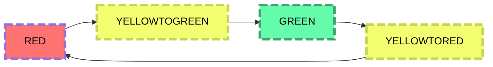

# Traffic light
## Запуск
Необходимо запустить ./building.sh
```
./build.sh
```
Затем нужно:
```
$ ./daemon &
[1] 5843
$ ./app
Succesfully connected to daemon!
Commands: 
	status
	poweron
	poweroff
	kill_daemon
	find_color
	set_color_red
	set_color_yellowgreen
	set_color_green
	set_color_yellowred

Enter command: status
Response from daemon: device is turned off
Enter command: poweron
Response from daemon: device started
Enter command: find_color
Response from daemon: Now color is RED
Enter command: poweroff
Response from daemon: device stopped
Enter command: killdaemon
Response from daemon: invalid request
Enter command: kill_daemon
Response from daemon: 

```
## Диаграмма состояний

## *app.c*
Файл клиентского приложения, реализующий функции для работы с пользователем. Через него можно запросить текущее состояние и изменить его, а также остановить работу daemon.

## *daemon.c*
Файл daemon, работающий с драйвером и через сокет общающийся с клиентским приложением.

## *driver_traffic_light.c and driver_traffic_light.h*
Файл драйвера, работающий с самим устройством напрямую.

## *state_light.txt*
Текстовый файл хранит текущее состояние светофора (имитирует состояние устройства для драйвера): **RED**, **YELLOWTOGREEN**, **GREEN**, **YELLOWTORED**. Состояния соответсвенно обозначают: **RED** - красный, **YELLOWTOGREEN** - желтый перед зелёным, **GREEN** - зелёный, **YELLOWTORED** - желтый перед красным.

## *time.txt*
На данный момент бесполезен.
Хранит время последнего изменения цвета в секундах.

## *app and daemon*
Исполняемые файлы соответственно.


