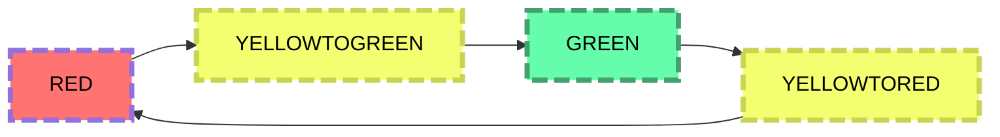

# Traffic light
При запуске *app* включает светофор и daemon, который изменяет текущий цвет через определенное время, имитируя работу светофора. Файл *state_light.txt* используется в качестве ресурса для хранения текущего состояния светофора. Файл *time.txt* хранит время последней смены цвета. Это необходимо для переключения сигнала через строго заданное время. Драйвер может запрашивать текущее состояние светофора и изменять его.
## Диаграмма состояний

## *app.c*
Файл клиентского приложения, реализующий функции для работы с пользователем. Через него можно запросить текущее состояние и изменить его, а также остановить работу daemon.

## *daemon.c*
Файл daemon, работающий с драйвером и осуществляющий смену цвета через заданное время.

## *driver_traffic_light.c and driver_traffic_light.h*
Файл драйвера, работающий с самим устройством напрямую.

## *state_light.txt*
Текстовый файл хранит текущее состояние светофора: **RED**, **YELLOWTOGREEN**, **GREEN**, **YELLOWTORED**. Состояния соответсвенно обозначают: **RED** - красный, **YELLOWTOGREEN** - желтый перед зелёным, **GREEN** - зелёный, **YELLOWTORED** - желтый перед красным.

## *time.txt*
Хранит время последнего изменения цвета в секундах.

## *app.exe and daemon.exe*
Исполняемые файлы соответственно.

